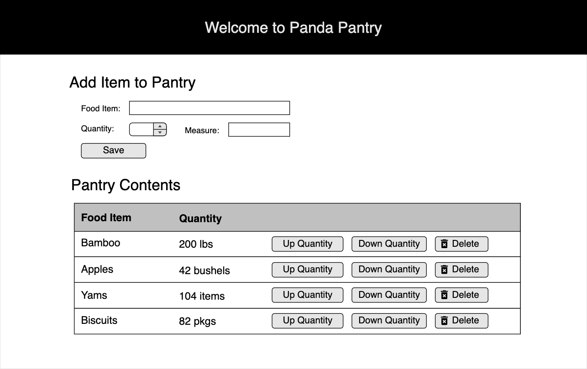

# FS React Panda Pantry

While wild pandas eat mainly bamboo, civilized pandas eat all sorts of fancy foods. With so many options, they need some help keeping track of it all. Panda Pantry to the rescue!

## Setup & Starter code

Checkout the starter code provided for you. There is a client side React starter application as well as server side code provided for you. Look through this to review what has been setup for you.

Run:
```
npm install
npm run server
```

Then in a new, _separate terminal window_, run:
```
npm run client
```

### Database Setup
Make sure your database is running and create a database called `fs-panda-pantry`. Run the provided `database.sql` file to setup the database table and populate some test data for the application. 


## Required Features (Base Mode)

The Panda Pantry needs web application to view and manage their list of available foods.  

### Inventory Component
The current pantry items should be displayed on the page in a table. Combine the quantity & measure together (for display) in one column. For example if the quantity is '200' and the measure is 'lbs', display this together as '200 lbs'. 

The Panda Pantry also needs to be able to remove foods from the list. Add a delete button to each item in the table allowing it to be removed from the database.

The quantity of items changes regularly, so to edit quickly they would like buttons to increase and decrease the quantity by 1.  

### Item Form Component

Add a form at the top of the page to allow the Panda Pantry staff to add new items to the database. Each new item *MUST* have a name, quantity, and measure.


### Sample Wireframe




## Stretch Features 

- Add a confirmation dialog to the delete button so that when the user clicks 'Delete' they are prompted to confirm whether they *really* want to delete the item or cancel the delete. 

- Add a note to the UI indicating that all fields are required.  On Save, validate that all inputs have a value. (You can do this by making the HTML inputs required.)  
  - Optionally, make sure the text entered isn't too long.

- Improve the styling of the page using Bootstrap & custom CSS
  - Improve the table layout. Give alternating rows a difference in color.
  - Make the buttons more UX friendly -- Red for delete, etc. Green for save.
  - Add a trash can icon for the delete button.
  - Make the page responsive -- Bootstrap Grid & Containers will be helpful!

### Enhanced Edit

Currently, if you typo something, it must be removed and re-added to fix it. An edit feature would be a great enhancement. 

The Panda Pantry users would like to be able to click an Edit button and have the existing data show in the input form at the top of the page to allow an easy edit. 

To do this update the Item Form Component to support and edit mode. Add a variable to the component `state` to indicate if we are in add or edit mode. 

Then add an edit button to each item in the table. When clicked:

- Save the item id in component `state`
- Switch the mode to edit
- Fill the form with the current item's information
- Change the heading from Add to Edit 
- When the submit button is clicked:
  - If the mode is add - do the original POST
  - If the mode is edit - send a PUT with the updated information
- Optionally, the edit mode also show a cancel button, which should switch back to add mode, clearing the inputs without saving data.